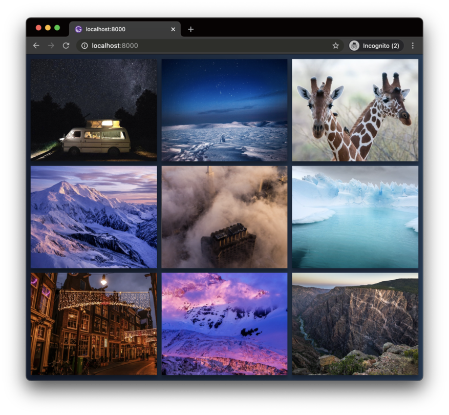

<div align="center">
<h1>react-instagram-media </h1>
  <br />
  <i>embeded images example <br /><br/><br/></i>
</div>

An `<InstagramMedia />` component for React and React Native.

The motivation behind this project was the need to "embed" Instagram content as part of a React/React Native application.

What this lib does? It fetches the Instagram Web page, parse the post data from there and present it. Formatted and ready to use.

This project have no say on how you present the data, though. You know best how it should look in your project and that's why we use render props.

## Usage

First, install it

`npm i react-instagram-media`

And then, it is ready to go both on React or React Native:

```jsx
import { InstagramMedia } from 'react-instagram-media'

<InstagramMedia
  uri="https://www.instagram.com/p/B866lKJgReK/"

  renderItem={
    ({ display_url, video_url, type, caption }) => {
      if (type === 'video') {
        return (
          <video poster={display_url} controls>
            <source src={video_url} type="video/mp4" />
          </video>
        )
      }

      return (
        
      )
    }
  }

  renderMediaList={children => (
    <div className="swiper">
      {children}
    </div>
  )}

  renderError={() => (
    <div>I have failed to parse it</div>
  )}

  renderLoading={() => (
    <div>Loading</div>
  )}
/>
```

## Properties

| Prop           |     Required     |   Type   | Description                                                                                                 |
| :------------- | :-------------: | :------: | :---------------------------------------------------------------------------------------------------------- |
| uri             |      true       |  `string`    | The uri of the post to get fetched  |
| renderItem      |      true       |  `function`  | Render prop for each media to be displayed. Receives the media's data as parameter.|
| renderMediaList |     false       | `function`   | Render prop for posts with multiple medias. Helps wrapping them into a swiper. Receives the media list as a parameter. |
| renderError   |      false      |  `function`  | Render prop for a standard error message. This can be useful if you don't trust Instagram, or this library. Receives the invalid uri as a parameter. |
| renderLoading       |      false      |  `function`  | Render prop for a standard loading message or placeholder. |

## Getting aditional post data

It may be the case that you want to display the post's description, or it's like count. You can do it by using the `getPostData` method.

```jsx
const post = useRef({})

if(post.current.getPostData) {
  console.log(post.current.getPostData())
}

<InstagramMedia
  ref={post}
  uri="https://www.instagram.com/p/B866lKJgReK/"
/>
```

## Programatically fetching a post

If you don't want to use our React component, we got you covered. Just do it by importing the `instagramMediaParser` function.

```js
import { instagramMediaParser } from 'react-instagram-media'

instagramMediaParser({ uri: 'https://www.instagram.com/p/B866lKJgReK/' })
  .then(post => console.log(post))
```

## React Native

Since all presentation is done using render props, you can use it in React Native and it *just works*™

```jsx
import { Image, View, Text } from 'react-native'

// ...

<InstagramMedia
  uri="https://www.instagram.com/p/B866sdflKJgReK/"

  renderItem={
    ({ display_url, dimensions }) => (
      <Image
        source={{ uri: display_url }}
        style={{ width: dimensions.width, height: dimensions.height }}
      />
    )
  }

  renderError={() => (
    <Text>I have failed to parse it</Text>
  )}

  renderLoading={() => (
    <Text>Loading</Text>
  )}
/>
```

## Want to help?

PR's are welcome. You can help by improving the docs, improving the code, adding tests, suggesting and discussing ideas in the issues.
